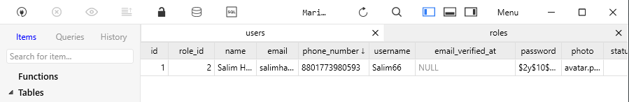

## Comet Multipurpose System
This is a learning purpose project for laravel developers. There are some features we are cover this project.


#### Features List
- Multilevel Auth System
- Blog app with all blog features
- eCommerce system with cart managements, orders system, customer managements etc
- Page managements - Homepage, About us, Contact us, Prizing page etc

## User Login System 
laravel login system must have same 3 place name.
*Example:*
 1. User Form name
```html
<div class="form-group row">
    <label for="email" class="col-md-4 col-form-label text-md-right">{{ __('E-Mail Address') }}</label>

    <div class="col-md-6">
        <input id="email" type="email" class="form-control @error('email') is-invalid @enderror" name="email" value="{{ old('email') }}" required autocomplete="email" autofocus>

        @error('email')
            <span class="invalid-feedback" role="alert">
                <strong>{{ $message }}</strong>
            </span>
        @enderror
    </div>
</div>
```
2. Login Controller return type
```phpregexp
     /**
     * Get the login username to be used by the controller.
     *
     * @return string
     */
    public function username()
    {
        return 'email';
    }
```
3.Database Column name


## Multiple login system username, email, phone number
```phpregexp
 /**
     * Get the login username to be used by the controller.
     *
     * @return string
     */
    public function username()
    {
        $login_data = request()->input('login_data');

        $cell = substr($login_data, 0, 4);

        if (filter_var($login_data, FILTER_VALIDATE_EMAIL)){
            $type = "email";
        }else if ($cell == '8801'){
            $type = "phone_number";
        }else {
            $type = "username";
        }

        request()->merge([$type => $login_data]);

        return $type;
    }
```
